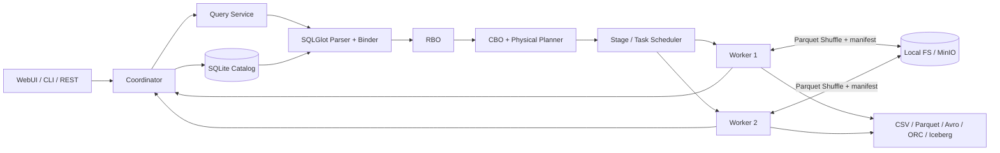
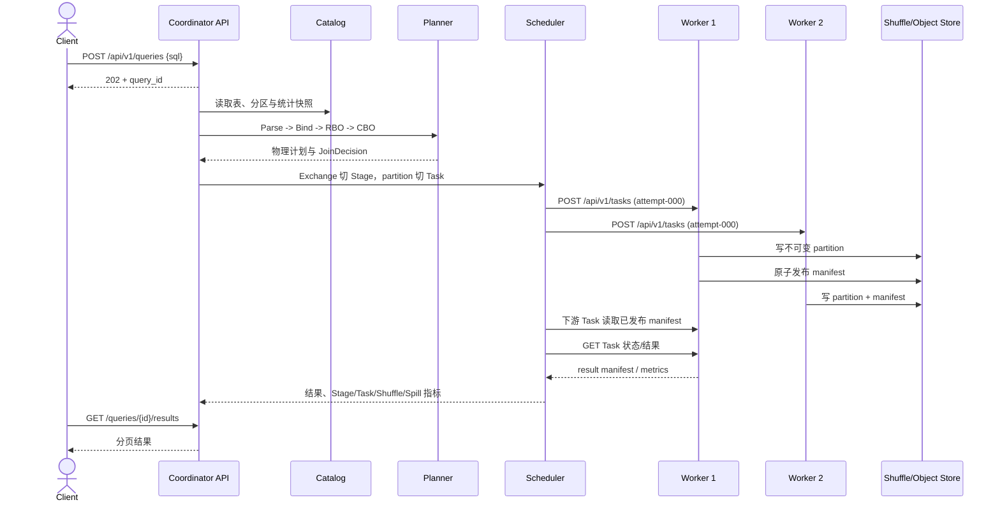
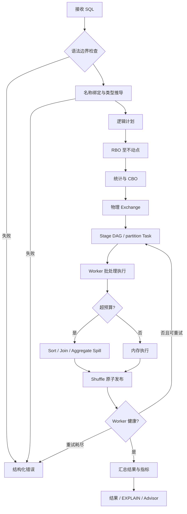

# 系统架构与运行流程

## 1. 架构总览

Coordinator 是控制面，负责查询生命周期、Catalog 快照、逻辑/物理规划、
Stage 切分和 Task 调度。Worker 是计算面，负责 PyArrow 批处理算子、Shuffle
读写、Runtime Filter、内存账户与 Spill。控制面使用 HTTP/JSON；大数据面使用
不可变 Parquet 文件和原子发布的 manifest，避免把批量数据塞进控制 RPC。

## 2. 模块边界

| 模块 | 职责 | 关键入口 |
|---|---|---|
| `common` | 配置、协议模型、统一错误 | `common/config.py`、`common/protocol.py` |
| `coordinator` | Worker 注册/租约、远程 Task 调度与查询 API | `coordinator/queries.py`、`remote_execution.py`、`registry.py` |
| `worker` | 注册、心跳、Task API 与数据算子执行 | `worker/agent.py`、`worker/app.py`、`worker/tasks.py` |
| `catalog` | SQLite 元数据、对象存储、导入 | `catalog/repository.py`、`importer.py` |
| `data_source` | 统一扫描接口与五类数据源 | `data_source/base.py`、`files.py`、`iceberg.py` |
| `planner` | SQL 边界、绑定、类型和逻辑计划 | `planner/parser.py`、`binder.py` |
| `optimizer` | 九条 RBO、统计、代价与 Join Reorder | `optimizer/rules.py`、`cbo.py` |
| `execution` | 物理计划、调度、算子、Shuffle、Spill | `execution/distributed.py`、`scheduler.py` |
| `cli` / `web` | 用户入口 | `cli/main.py`、`web/static/` |
| `advisor` / `observability` | 诊断指标和确定性建议 | `advisor.py`、`observability.py` |

## 3. 模块交互

Task API 为 `POST /api/v1/tasks`、`GET /api/v1/tasks/{attempt_id}`、
`DELETE /api/v1/tasks/{attempt_id}` 和
`GET /api/v1/tasks/{attempt_id}/result`。只有成功 attempt 的结果或 Shuffle
manifest 会进入下游输入。Worker 失联时，Scheduler 丢弃并清理该 attempt，
再在另一健康 Worker 上创建新 attempt。部署模式使用 bearer token 认证所有
Task API；对象存储密钥经进程配置/Secret 注入，协议只携带共享 `s3://` URI。

## 4. 查询运行流程

1. Parser 明确拒绝 DML、CTE、子查询和集合操作；Binder 解析列归属、NULL
   语义、隐式转换并构造逻辑节点。
2. RBO 逐条递归重写，直到计划不再变化；循环指纹和最大迭代数防止死循环。
3. CBO 使用 Catalog 统计估算行数、CPU、网络、内存和磁盘代价，选择构建侧、
   Shuffle 策略，并对合法 Inner Join 区域做动态规划重排。
4. 物理规划在 Exchange 处分割 Stage，以 partition 生成 Task。Worker 槽位控制
   并发，依赖 Stage 成功后才调度下游。
5. 算子以 PyArrow `RecordBatch` 交换数据。到达执行账户阈值前，排序、Join
   和聚合切换到外部算法；临时目录按 query/task/attempt 隔离并在退出时清理。
6. 完成后生成结果、EXPLAIN、运行指标、重试时间线及基于规则的 AI4DB 建议。

## 5. 分布式设计取舍

- **分区是最小调度单位**：Stage 表达依赖，Task 表达 partition，attempt 表达
  一次可替换执行，使失败重试不改变逻辑 Task 身份。
- **Exchange 是物化边界**：Hash、Broadcast 和 Single 分布都通过显式 Exchange
  表达，Stage DAG 可序列化、可解释。
- **不可变数据加原子清单**：数据文件先写入 attempt 路径，manifest 最后发布；
  下游校验大小、SHA-256 和行数后再读取。
- **确定性优先**：稳定 Hash、稳定 Worker 轮询和计划文本排序使测试及答辩证据
  可复现。
- **控制面与数据面分离**：HTTP 管理查询和节点，大数据通过共享文件/对象存储
  传递；跨容器/主机时 Scan、Shuffle、manifest 和结果都位于同一 S3/MinIO
  bucket，本机模式则可使用共享文件目录。
- **明确容错边界**：支持单 Worker 故障和 Task 重试，不支持 Coordinator 主备、
  跨 Coordinator 查询恢复或多节点同时故障的无条件成功。
