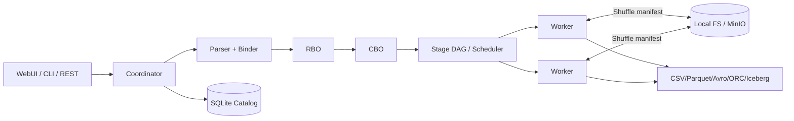
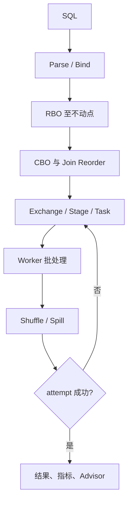

# 分布式 SQL 计算系统答辩汇报

## 1. 项目信息

- 项目名称：Distributed SQL
- 公开仓库地址：`【待填写：GitHub/GitLab 公开仓库 URL】`
- 项目成员与分工：

| 成员 | 分工 | 主要产出 |
|---|---|---|
| `【待填写】` | `【待填写】` | `【待填写】` |
| `【待填写】` | `【待填写】` | `【待填写】` |
| `【待填写】` | `【待填写】` | `【待填写】` |

## 2. 项目介绍

本项目从零实现课程级分布式 SQL 引擎，目标是在一套可部署、可测试的代码中
串联 SQL 解析、逻辑计划、RBO、统计与 CBO、Stage/Task 调度、Shuffle、故障
恢复和有限内存执行。

技术栈为 Python 3.12、FastAPI、SQLGlot、PyArrow、SQLite、PyIceberg 和 MinIO。
SQLGlot 只负责语法解析；关系代数、优化规则、代价模型、物理计划和执行均由
项目实现。DuckDB 只在测试中作为结果参考。

## 3. 系统设计



Coordinator 管理 SQL 生命周期、Catalog、计划和调度；Worker 执行 PyArrow
批处理算子。HTTP/JSON 承担控制面，不可变 Parquet 文件和原子 manifest 承担
大数据面。详细模块图和时序图见[架构文档](architecture.md)。

## 4. 查询运行流程



RBO 覆盖作业要求的九条规则；CBO 根据统计选择 Hash Join 构建侧和 Shuffle，
并用子集动态规划重排连续 Inner Join。Exchange 是 Stage 边界，partition 是
Task 粒度，attempt 是故障重试粒度。

## 5. 核心实现

### 5.1 优化器

- 固定顺序规则迭代至不动点，记录每次改写并检测循环。
- Predicate 下推遵守 Aggregate 分组键和 Outer Join 保留侧语义。
- 代价模型包含 CPU、网络、内存和磁盘；缺失统计使用可解释的保守默认值。
- Join Reorder 只进入确定性 Inner Join 区域，不越过 Outer Join 边界。

### 5.2 Shuffle 与容错

- 支持已有分区复用、Broadcast、左/右/双侧 Repartition。
- 稳定 Hash 保证相同 Join Key 到达相同目标 partition。
- Shuffle 路径包含 query/stage/task/attempt/partition，manifest 原子发布。
- 租约发现 Worker 失联；新 attempt 在健康 Worker 上重试，只消费成功 manifest。

### 5.3 有限内存执行

- query/task 层级内存账户，默认执行账户预算 64 MiB。
- ORDER BY 使用外部归并排序。
- Join 使用分区 Hash Join，必要时回退 Sort-Merge Join。
- 高基数聚合使用 Sort Aggregate run；临时文件在成功、失败和取消后清理。

核心代码导读见[实现说明](implementation.md)。

## 6. 功能验证

- SQL：Scan、Project、Filter、Aggregate、四类 Join、Limit、Order、Having、
  Window、Grouping Sets、COUNT DISTINCT。
- 数据：CSV、Parquet、Avro、ORC 和 Iceberg 当前快照。
- 入口：REST、CLI 和 WebUI；支持查询提交、取消、结果、计划、指标、节点和
  Catalog 管理。
- 部署：本机多进程、Docker Compose 和 Kubernetes；Kubernetes 验证升级与
  `rollout undo` 后 Catalog 数据保持。
- 诊断：结构化日志、EXPLAIN ANALYZE、Stage/Task 指标和确定性 AI4DB 顾问。

原评分项到代码、测试和命令的逐项映射见[验证报告](verification.md#原评分项映射)。

## 7. 测试结果

Task16 于 2026-08-31 生成的证据：

- 快速测试：161 passed，0 failed，0 skipped，JUnit 耗时 71.054 s。
- 独立压力测试：1 passed，JUnit 耗时 43.277 s。
- 压力数据：32 个 Parquet 文件，16,384 行，1,074,448,160 字节
  （1.000658 GiB）。
- 两个逻辑 Worker，每个执行账户预算 67,108,864 字节。
- Sort、Join、Aggregate 三项结果摘要均与 DuckDB 一致，并都发生 Spill。

| 工作负载 | 执行账户峰值(B) | Spill(B) | 关键外部结构 |
|---|---:|---:|---|
| Sort | 67,090,212 | 898,065 | 5 个 external run |
| Join | 67,074,882 | 9,651,243 | 16 个 hash partition |
| Aggregate | 67,074,318 | 855,101 | 8 个 sort aggregate run |

执行账户不是进程 RSS。三项 RSS 峰值分别为 2,135,519,232、2,308,820,992、
2,107,895,808 字节，因此只主张“被计费的算子对象未超过 64 MiB 预算”，不主张
进程总内存为 64 MiB。原始 JSON 位于
[`artifacts/task16/task16-results.json`](../artifacts/task16/task16-results.json)。

Task18 定向证据位于
[`artifacts/task18/task18-results.json`](../artifacts/task18/task18-results.json)：
HTTP/JSON 控制面将 Scan、算子和 Shuffle Task 发往两个独立 Worker PID；终止
`worker-1` 后，首 attempt 为 LOST，`worker-2` 的 retry 成功。定向测试
通过；最终全量非 stress 为 `166 passed, 1 deselected`，Ruff 与 Mypy 通过。
Compose 使用 MinIO `s3://` URI 完成远程 Scan、Shuffle、结果物化和 Coordinator
重启后的持久化查询，证据位于 `artifacts/task18/compose-results.json`。

## 8. 分布式思想

1. **控制与数据分离**：控制消息走 HTTP，大批量数据走不可变文件。
2. **显式数据分布**：Exchange 描述 Hash/Broadcast/Single，计划可解释。
3. **分层执行标识**：Query、Stage、Task、Attempt 支持状态关联和局部重试。
4. **幂等提交**：attempt 输出隔离，manifest 原子发布，下游只读成功版本。
5. **局部聚合**：可拆分聚合执行 partial、Shuffle、final，减少跨节点数据。
6. **统计驱动决策**：以基数和多维代价选择构建侧、Shuffle 和连接顺序。

## 9. 已知限制

Coordinator 是单点，查询状态与结果保存在进程内；SQL 是明确子集；Iceberg
只读当前快照；查询数据面使用注册 Worker endpoint，但计划片段仍采用可信
Python 同版本 pickle 序列化。该片段有显式格式/version 且仅允许通过 bearer
token 认证的内部 Task API 输入，不能接收任意外部数据；跨容器数据面使用
MinIO，本机可使用共享文件目录。不提供用户 API 认证、事务、资源队列和多节点
同时故障保证。64 MiB 是执行账户预算，不是进程硬上限。
完整限制见[验证报告](verification.md#已知限制)。

## 10. 演示建议

```powershell
uv run -- python -m distributed_sql.local_cluster --workers 2
uv run -- python -m distributed_sql.cli.main explain `
  "SELECT region, SUM(amount) AS total FROM orders GROUP BY region ORDER BY total DESC"
uv run pytest tests/test_worker_recovery.py -q
Get-Content artifacts/task16/task16-summary.md
```

演示顺序：WebUI 提交查询与查看计划；解释 RBO/CBO 决策；展示 Shuffle/Spill
指标；运行故障测试；最后打开 Task16 JSON，说明正确性、内存口径和限制。
